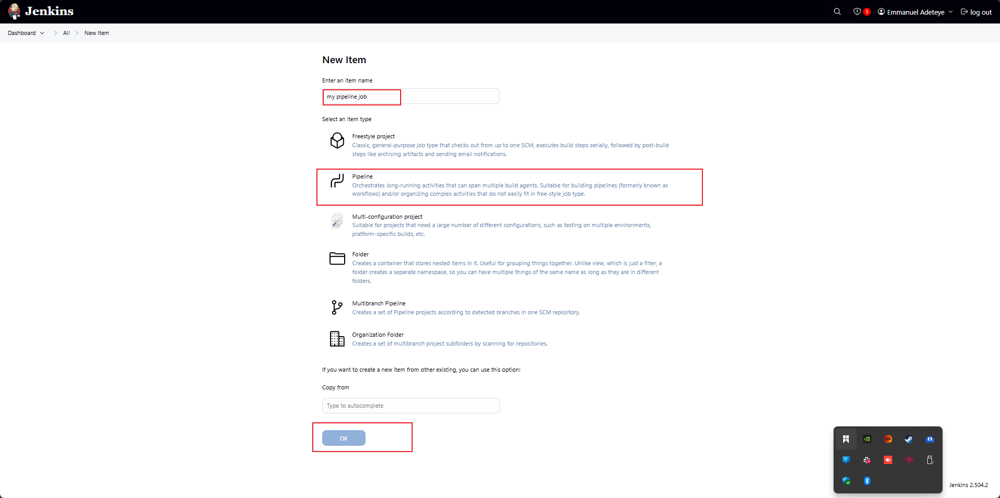
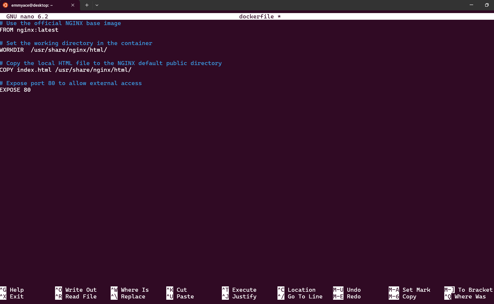

# jenkins-pipeline
A Jenkins Pipeline job is a powerful type of Jenkins job that lets you define your entire build, test, and deploy process as code, using a special script called a Jenkinsfile. This approach provides far more flexibility, scalability, and automation compared to Freestyle jobs

## STEP 1: Creating a pipeline jon

* From the dashboard menu select new item

* Create a pipeline job named "my pipeline job"

## STEP 2: Configuring the Build Trigger

* Click on configure then click triggers selecting "GitHub hook trigger for GITScm polling"

* create a webhook for the git repository "jenkins-scm" that is being connected to the jenkins

## STEP 3: WRITING THE JENKINS PIPELINE SCRIPT
A jenkins pipeline script refers to a script that defines and orchestrates the steps and stages of a continous integration and continous delivery (CI/CD) pipeline:
:
* Writing the script

      pipeline {
        agent any

        stages {
        stage('Connect To GitHub') {
            steps {
                checkout scmGit(
                    branches: [[name: '*/main']],
                    extensions: [],
                    userRemoteConfigs: [[url: 'https://github.com/Emmyace-hub/jenkins-scm.git']]
                )
            }
        }

        stage('Build Docker Image') {
            steps {
                script {
                    sh 'docker build -t dockerfile .'
                }
            }
        }

        stage('Run Docker Container') {
            steps {
                script {
                    sh 'docker run -itd -p 8081:80 dockerfile'
                }
            }
        }
      
      }
      
      }

* Paste the script into the pipeline script inside the configuration

## STEP 4: GENERATING SYNTAX FOR THE GITHUB REPOSITORY

* Click on the pipeline syntax

* Select "checkout: check out from version control" and paste the github repository url "https://github.com/Emmyace-hub/jenkins-scm.git"
 

* Generate pipeline script by clicking generate pipeline script where the script is generated 
     "checkout scmGit(branches: [[name: '*/main']], extensions: [], userRemoteConfigs: [[credentialsId: 'c5c80f78-da68-4261-a50b-0badb5035765', url: 'https://github.com/Emmyace-hub/jenkins-scm.git']])"

## STEP 5 : Installing docker as it must be installed on the same instance jenkins was installed 

* create a file "docker.sh" and make it executable

* input the script below into the dockerfile just created 

      sudo apt-get update -y
      sudo apt-get install ca-certificates curl gnupg
      sudo install -m 0755 -d /etc/apt/keyrings
      curl -fsSL https://download.docker.com/linux/ubuntu/gpg | sudo gpg --dearmor -o /etc/apt/keyrings/docker.gpg
      sudo chmod a+r /etc/apt/keyrings/docker.gpg

       # Add the repository to Apt sources:
      echo \
      "deb [arch=$(dpkg --print-architecture) signed-by=/etc/apt/keyrings/docker.gpg] https://download.docker.com/linux/ubuntu \
      $(. /etc/os-release && echo "$VERSION_CODENAME") stable" | \
      sudo tee /etc/apt/sources.list.d/docker.list > /dev/null
      sudo apt-get update -y
      sudo apt-get install docker-ce docker-ce-cli containerd.io docker-buildx-plugin docker-compose-plugin -y
      sudo systemctl status docker

* Execute the file using the command:

      ./docker.sh
      

 ## STEP 6: BUILD PIPELINE SCRIPT
 * Create a new file named "dockerfile"
 

 * write the scode inside the new "dockerfile"

        # Use the official NGINX base image
        FROM nginx:latest

        # Set the working directory in the container
        WORKDIR  /usr/share/nginx/html/

        # Copy the local HTML file to the NGINX default public directory
        COPY index.html /usr/share/nginx/html/

        # Expose port 80 to allow external access
        EXPOSE 80

* create an 'index.html'  file writing the content below into it
      
      Congratulations, You have successfully run your first pipeline code.

* push both the dockerfile and index.html on the github repository 

* click on build now

* click status to show the process

* click stage to see the stage view

* Edit the inboud rule To access the 'index.html' on the web browser and open to the mapped container port 8081

* to access the content of index.html on the web browser : http://jenkins-ip-address:8081
